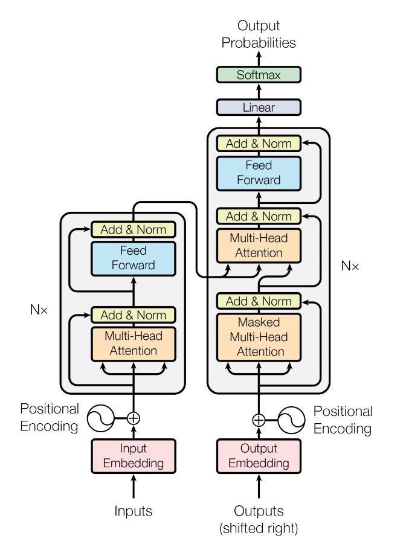

# Vision Transformers (ViT):
Traditionally, Convolutional Neural Networks (CNNs) have been the go-to models for visual tasks, but ViTs offer a novel alternative. By leveraging the self-attention mechanisms and Transformer architectures, ViTs break the limitations imposed by local receptive fields in CNNs.
## Why ViT?
They capture global dependencies and long-range interactions within an image. This leads to remarkable performance improvements in various computer vision tasks, including image classification, object detection, and image generation.

The network’s ability to focus on different input areas at different times allows it to capture local and global relationships, so collect spatial relationships in images more effectively than other types of neural networks. They have the ability to effectively model high-dimensional visual data.
transformers are a type of neural network architecture that:

processes incoming data through self-attention techniques. 
The self-attention mechanism
allows the network to focus on different sections of the input data at other times. It allows to capture both local and global associations

Image Classification: Image classification is the most typical use of vision transformers, with the purpose of assigning an image to one of several pre-defined categories. Vision transformers have demonstrated competitive or superior performance to standard CNN-based models on various image classification benchmarks, including ImageNet, CIFAR-100, and the recently released ImageNet-21K.

## conventional feedforward: 
each neuron in a given layer is connected to all neurons in the next layer.
## self-attention mechanism:
each neuron in a specific layer is connected to all other neurons in that layer, including itself.

the input image is divided into a grid of patches, and each patch is treated as an element in the input sequence.

# Attention Mechanism in Computer Vision (CV):
The model needed to focus on different image portions at different times.

Attention mechanisms are utilized in vision transformers to record the image’s local and global spatial relationships. Instead of using convolutions to extract image features, the input image is partitioned into a grid of patches, with each patch regarded as a sequence element. The self-attention mechanism is then applied to the sequence of patch embeddings to generate a new set of embeddings that represent the spatial relationships between the patches.

Vision transformers can capture long-range dependencies and relationships between patches in the image more effectively by using self-attention rather than convolutions

# Patch-based Processing:

breaking the input image into smaller, fixed-size patches and treating each patch as a single token. This method has both advantages and cons.

## Advantages:
* vision transformers may accept inputs of various sizes without extra resizing or cropping. This is especially beneficial for applications like object detection and segmentation, where the size and shape of the objects in the image might change significantly.

* interactions between patches throughout the image, allowing for more excellent capture of the global image context. This is especially significant for tasks like scene comprehension or image captioning, where the context and interactions between items in the image are critical for creating accurate descriptions.

## Drawbacks:
* spatial information is lost because each patch is handled as a separate token, and the relative positions of the patches are not explicitly stored. This can impair performance in tasks that rely substantially on spatial relationships, such as fine-grained object recognition or geometric reasoning.

* the computational and memory costs of processing many patches. To some extent, this can be addressed by employing techniques such as overlapping patches or hierarchical processing, but it remains a substantial difficulty for large-scale applications.
* 
### Patch Embeddings:
A linear projection separates the input image into a grid of non-overlapping patches, with each patch represented as a vector. After that, the patch embeddings are concatenated along the channel dimension to generate a vector sequence sent to the transformer encoder.

### Multi-head Self-attention:
The transformer encoder comprises several layers of multi-head self-attention, allowing the model to capture local and global interactions between patches. Each multi-head self-attention layer comprises a self-attention mechanism, a normalization layer, and a feedforward network.

### Multi-Head Attention:
The model’s self-attention mechanism enables it to attend to different parts of the input sequence at other times, allowing it to capture local and global correlations. Each patch embedding is converted into a collection of queries, keys, and values and then used to calculate attention weights. The attention weights are utilized to calculate a weighted sum of the values, which is used as the self-attention layer’s output.

### Normalization Layer:
After applying the attention mechanism, we pass the output through a normalization layer, which helps stabilize the learning process by ensuring a reasonably consistent distribution of activations across different instances.

The vision transformer learns a hierarchical representation of the input image by stacking many layers of patch embeddings, multi-head self-attention, and feedforward networks. This allows it to capture both low-level features and high-level semantic information.

# Building the Transformer Model with PyTorch for image classificaiton task:

Split an image into patches (fixed sizes).
Flatten the image patches.
Create lower-dimensional linear embeddings from these flattened image. patches.
Include positional embeddings.
Feed the sequence as an input to a state-of-the-art transformer encoder.
Pre-train the ViT model with image labels, which is then fully supervised on a big dataset.
Fine-tune the downstream dataset for image classification.

## CNN vs. ViTs:

The Vision Transformer is a model that utilizes the architecture of a transformer, initially designed for text-based tasks, to handle image classification. Unlike Convolutional Neural Networks, which process images as pixel arrays, ViT breaks down the image into fixed-sized patches, which are treated as visual tokens and embedded. The model then uses positional embeddings to process the patches as sequences and feed them into a Transformer encoder for the prediction of image class labels.

The performance comparison between a Convolutional Neural Network and a Vision Transformer depends on several factors, such as the size of the dataset, the complexity of the task, and the architecture of the models.

ViT exhibits excellent performance when trained on large datasets, surpassing state-of-the-art CNNs in accuracy while requiring 4x less computational resources. The successful application of transformers in NLP tasks has now been extended to images, where ViTs have proven to be highly effective in image recognition.

The Vision Transformer model outperforms Convolutional Neural Networks in terms of computational efficiency during pre-training. However, ViT lacks the inductive bias present in CNNs, which leads to a greater dependence on regularization or data augmentation techniques when working with smaller datasets. To obtain optimal performance, it may be necessary to incorporate additional model regularization or data augmentation strategies when using Vision Transformers.

Generally, CNNs are known for their strong spatial information processing capabilities, which make them well-suited for image classification tasks that require local feature extraction. They achieve this by applying convolutional filters to the input image, which learn local features such as edges, corners, and textures.

On the other hand, ViTs are designed to handle large-scale datasets, and they rely on the transformer architecture, which was originally developed for NLP tasks, to process the tokenized image patches. ViTs can capture long-range dependencies between the tokens, which allows them to capture more global information about the image.

In terms of performance, a ViT can surpass the performance of a CNN when trained on very large datasets, such as those containing over 14 million images. However, if the dataset is smaller, it is often more effective to use established models like ResNet or EfficientNet.

This is because ViTs have a large number of parameters, which can be difficult to optimize on smaller datasets, whereas CNNs are typically more effective in these scenarios. In conclusion, the choice between a CNN and a ViT will depend on the specifics of the task at hand and the available resources, such as the size of the dataset and computational power.

### References:

[#1](https://www.analyticsvidhya.com/blog/2023/06/vision-transformers-vit-revolutionizing-computer-vision/)

[#2](https://blog.roboflow.com/what-is-a-transformer/)
